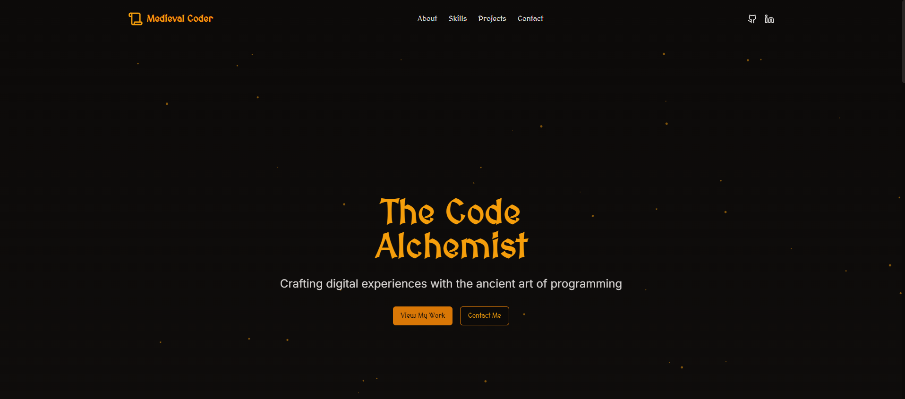
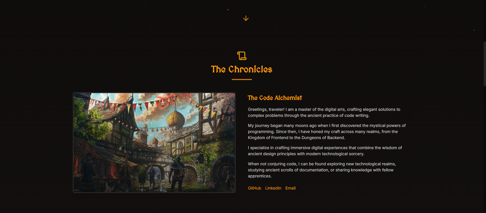
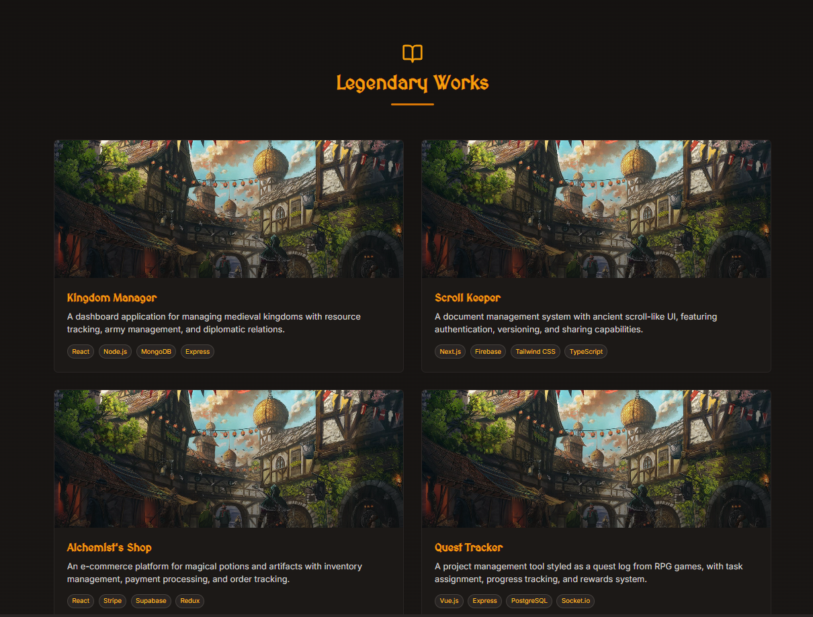
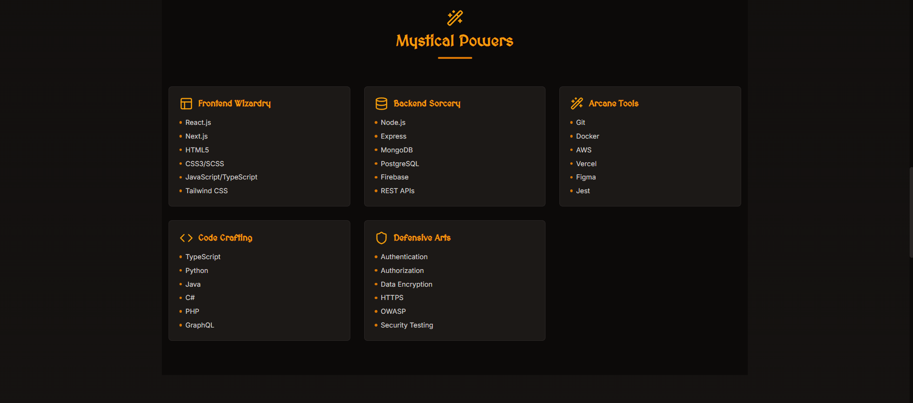

# Medieval Portfolio Template

Welcome to the Medieval Portfolio Template! Easily customize your personal info, projects, skills, and social links.

## Getting Started

1. **Install dependencies:**  
   Run `pnpm install` or `npm install` in your project folder.
2. **Start the development server:**  
   Run `pnpm dev` or `npm run dev`.
3. **Open your browser:**  
   Go to [http://localhost:3000](http://localhost:3000) to view your site.

## How to Customize

### 1. Edit Your Info
- Open `data/user.ts`.
- Change your name, title, bio, and social links.

### 2. Edit Your Projects
- Open `data/projects.ts`.
- Add, remove, or edit projects. Each project can have a title, description, image, tags, live demo link, and GitHub link.

### 3. Add Project Images
- Place your images in the `public/images/` folder.
- Reference them in your project data (e.g., `image: "/images/myproject.jpg"`).

### 4. Social Links
- Update your GitHub, LinkedIn, and email in `data/user.ts`.

### 5. Edit Your Skills
- Open `data/skills.ts`.
- Add, remove, or edit skill categories and items. Each category can have a name, icon, and a list of skills.

---

## More Screenshots

### About Page

### Projects Page

### Skills Page

Happy coding! 